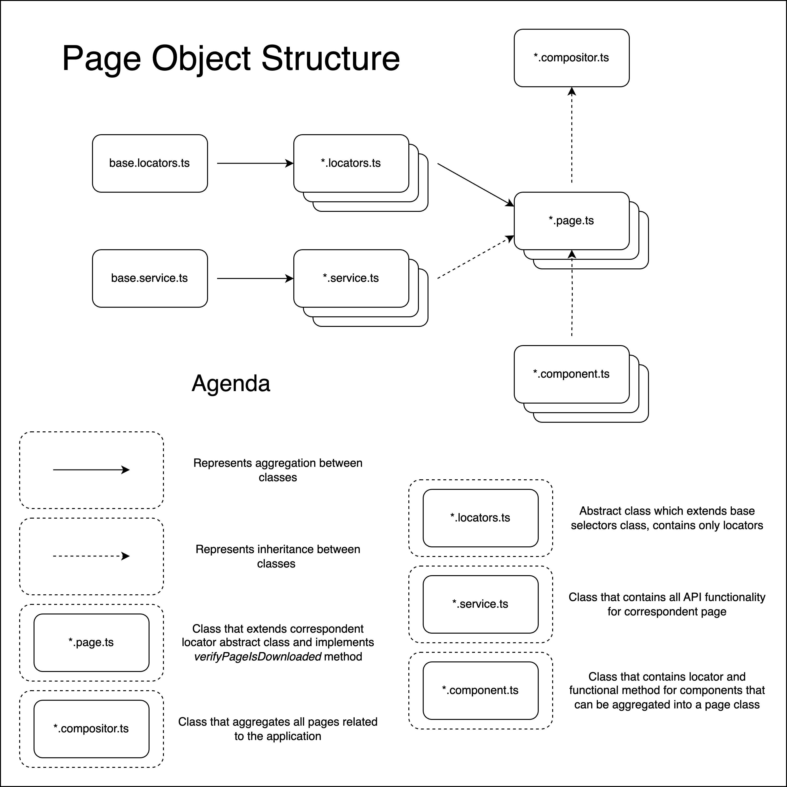

# Moralis Tech Task

## Overview

This project is a technical task designed to demonstrate the implementation of **scalable** and **extensible** test framework for running UI, API and load tests using **Playwright** and **K6** frameworks.

## Features

- **Authentication:** Utilize UI authentication to save session cookies, significantly reducing the time required to authenticate into the Moralis Admin app and enabling efficient UI and API interactions.
- **UI & API Tesing integration:** Playwright is used to automate testing scenarios, including UI authentication, functional and end-to-end (E2E) tests, as well as API response validation.
- **Load Testing integration:** Utilizes K6 for load testing, to test performance under various traffic conditions.

## Test Framework Structure



## Setup Instructions

### Prerequisites

- [Node.js](https://nodejs.org/en) installed (v20.\*).
- [bun](https://bun.sh/) installed.
- [K6 framework](https://k6.io/docs/get-started/installation/) installed.

### Installation

1. Clone the repository:
   ```bash
   git clone https://github.com/itev4n7/moralis-tech-task.git && cd moralis-tech-task
   ```
2. Install dependencies:
   ```bash
   bun install
   ```
3. Install Playwright browsers:
   ```bash
   bun playwright install
   ```

### Configuration

- **Environment variables:** Create a `.env` file based on the provided `.env.sample` and fill in the required parameters.

### Running Tests

- **Setup Playwright:**

  - Run the setup script to login and retrieve an auth token:
    ```bash
    bun run setup-auth
    ```

- **UI Playwright tests:**

  - Run the UI tests using Playwright (before execusion you need to run `Setup Playwright` script):
    ```bash
    bun run test-ui
    ```
  - Run the E2E tests using Playwright (before execusion you need to run `Setup Playwright` script):
    ```bash
    bun run test-e2e
    ```

- **API Playwright tests:**

  - Run the UI tests using Playwright (before execusion you need to run `Setup Playwright` script):
    ```bash
    bun run test-api
    ```

- **Run Load Tests with K6:**

  - Execute the load tests using K6 (before execusion you need to run `Setup Playwright` script):
    ```bash
    bun run test-k6-load
    ```
  - Execute the load tests using bash script:
    ```bash
    ./scripts/run-load-test.sh
    ```

## License

This project is licensed under the MIT License.
